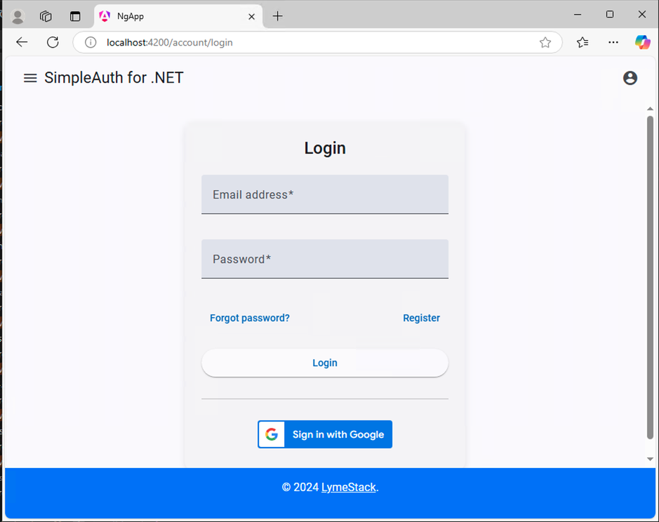

# SimpleAuth for .NET

**Note:** This project is currently in alpha, and the documentation is in draft form.

SimpleAuth for .NET is a free and open-source solution designed to simplify user and role-based authentication and authorization in .NET WebAPI and client applications.

The goal of this project is to provide small to medium-sized businesses and organizations with a straightforward, cost-effective infrastructure for identity management. Built for a .NET 9 WebAPI backend, SimpleAuth serves as an alternative to [expensive commercial products](./documentation/background.md#other-commercial-providers) and Microsoft's [ASP.NET Core Identity](https://learn.microsoft.com/en-us/aspnet/core/security/authentication/identity) framework, which can be complex.

## Why Choose SimpleAuth?

- Simplifies the often complex and tedious process of implementing authentication.
- Offers an alternative to the steep learning curve of ASP.NET Core Identity.
- Provides a free identity management option for smaller organizations with budget constraints.
- Allows you to focus on building your application, rather than spending excessive time on authentication setup.

## Features of SimpleAuth

SimpleAuth is designed to prioritize ease of use while delivering essential functionality:

1. **Quick Integration:** Seamlessly integrate into an existing WebAPI project.
2. **Core Workflows Supported Out of the Box:** Includes login, logout, registration, and password recovery.
3. **User and Role Management:** Manage users and roles with minimal setup, eliminating the need to create extensive UI from scratch.

### API Overview

[The API](./documentation/api.md) is organized into two primary categories:

- **Public Endpoints:** Support authentication, registration, and password reset workflows.
- **Private Administrative Endpoints:** Designed for user and role management, protected by an "Admin" role.

### Frontend Support

SimpleAuth currently supports three client frameworks: Angular v18, React v18, and Vue v3. The Angular implementation is the most polished, while the React and Vue versions are in earlier stages of development. Contributions to enhance existing front-ends or add support for additional frameworks are highly encouraged.

## Getting Started with SimpleAuth

To begin using SimpleAuth for .NET on your local machine, follow the step-by-step instructions in the [Getting Started Guide](./documentation/index.md). The guide provides a comprehensive walkthrough to help you set up and begin leveraging SimpleAuth in your project.

---

We welcome your feedback and contributions to improve this project. Whether you're enhancing the documentation, refining the front-end clients, or suggesting new features, your input is valuable to making SimpleAuth better for everyone.
