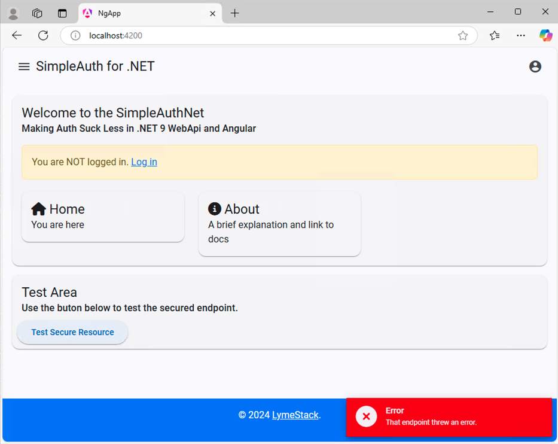
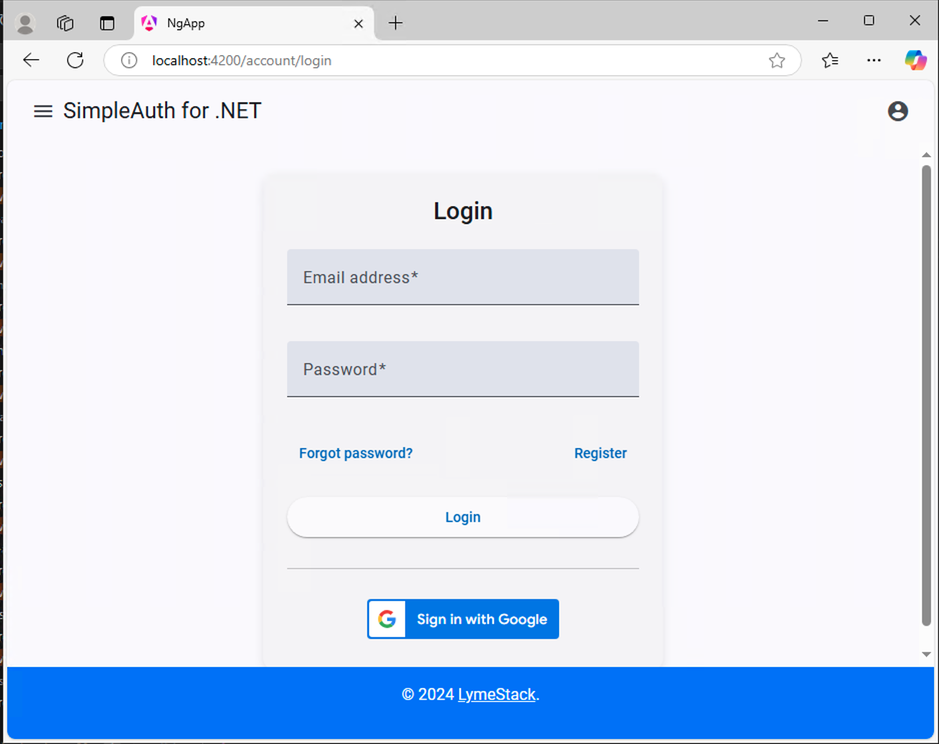
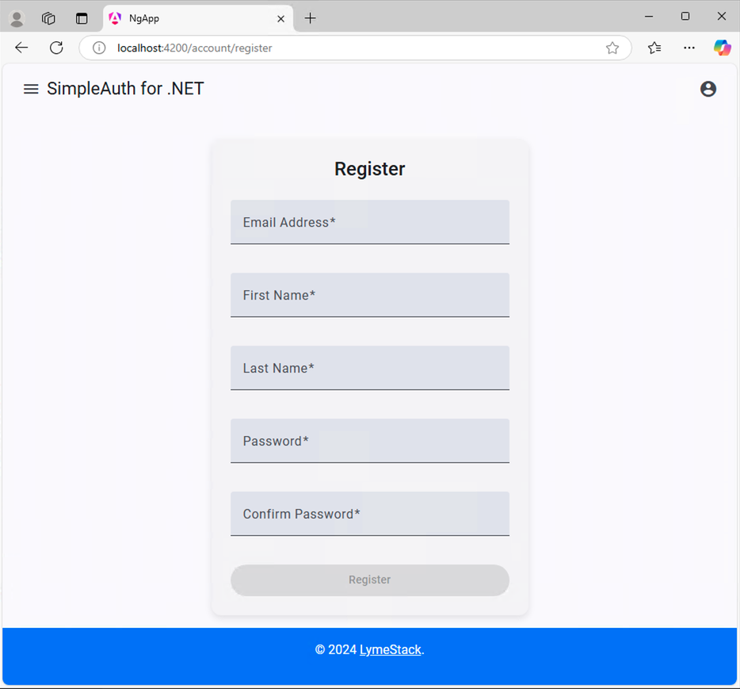
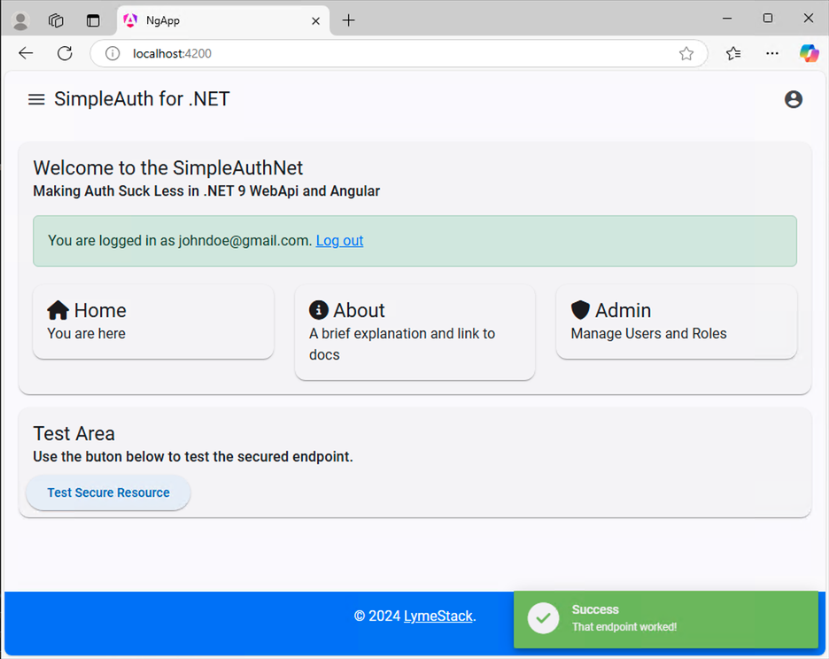

# The Angular App

The Angular App currently offers the most refined experience when it comes to interacting with the SimpleAuth for .NET API. More work needs to be done to bring the React and Vue implementations more comprehensive.

## Initial Home Page

Upon opening the application for the first time, you should see this screen: A page saying you are logged out with the ability to initiate the login process. Clicking the "Test Secure Resource" button will make the client application attempt to access a secured API endpoint and will produce the red error message as seen in the screenshot below:

## Login Page

Here's the standard login screen. You can enter credentials for a local account or sign in with Google (if enabled).

## Register Page

This is the register page.**NOTE: The first user registered in the system will be automatically assigned Admin rights.**

## Verification Pending

## Home Page after Logging In

After successfully

Administrative users can proceed with [Managing Users and Roles](./user-role-admin.md).
