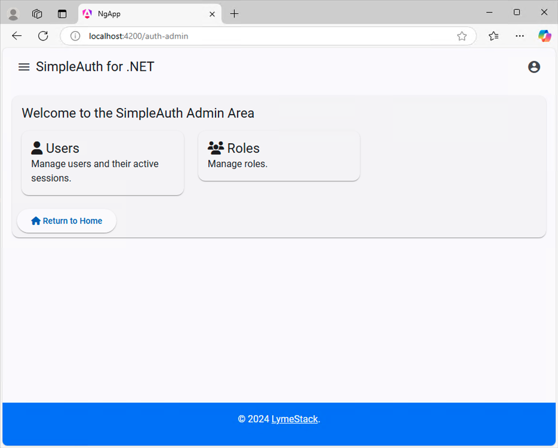
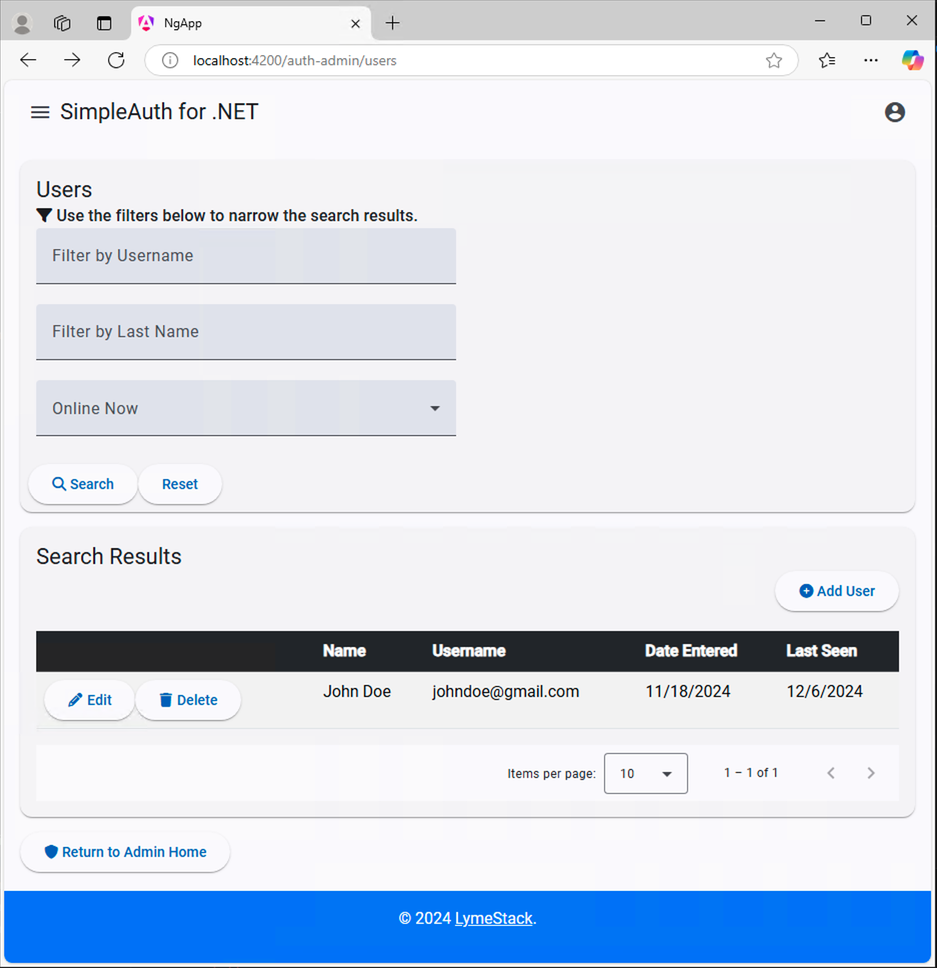
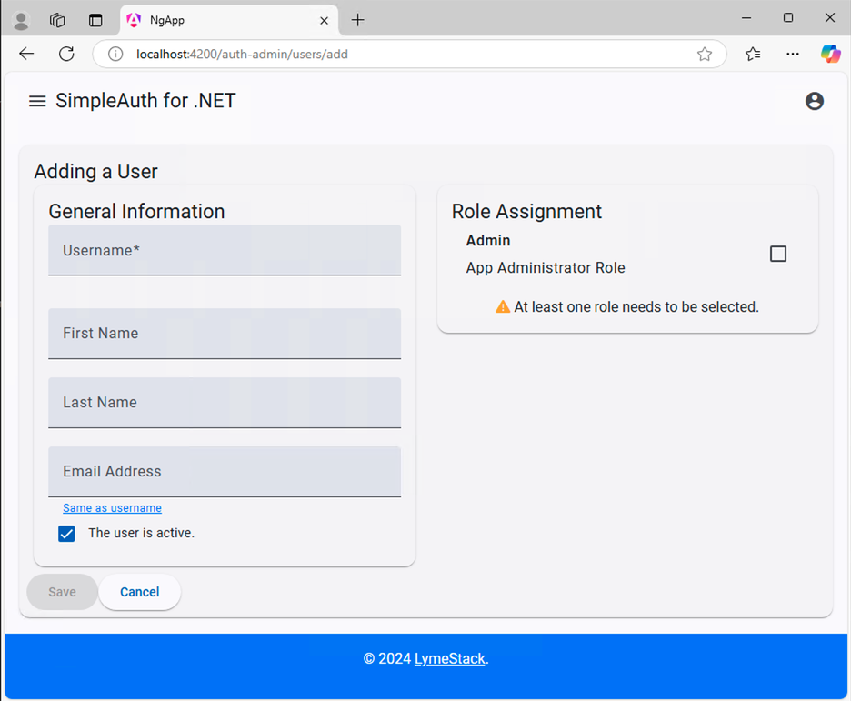
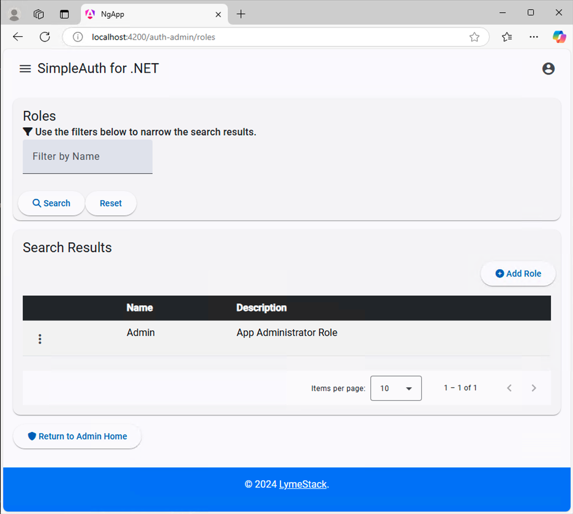
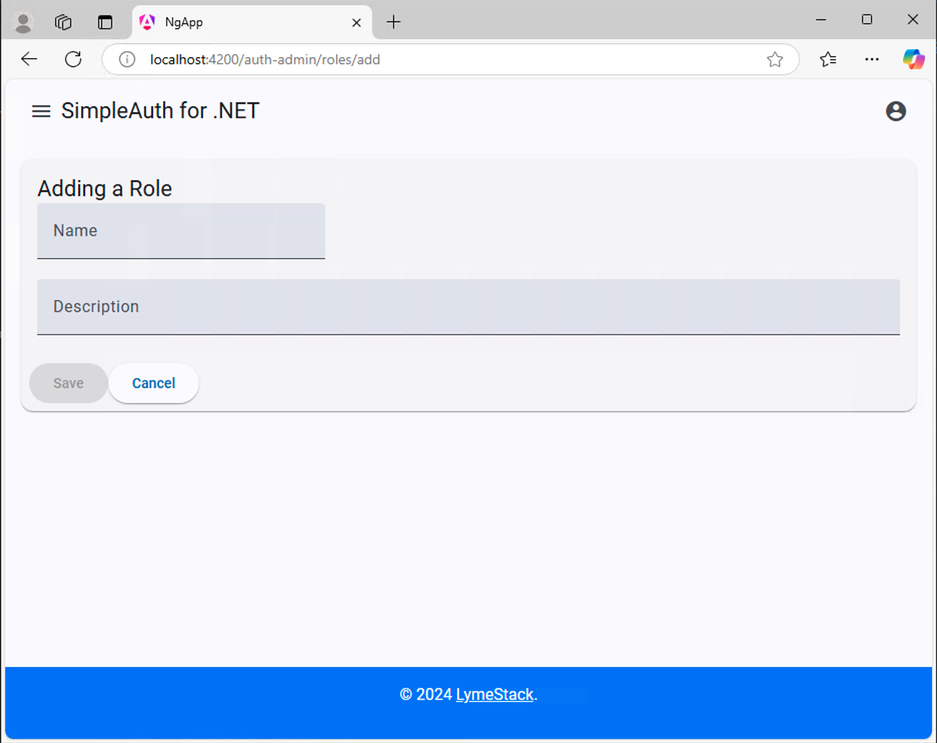

# The Angular App

The Angular App currently offers the most refined experience when it comes to interacting with the SimpleAuth for .NET API. More work needs to be done to bring the React and Vue implementations more comprehensive.

## Configuring the API URL

The API URL in the Angular front-end is located in the `main.ts` file.

## Core Services

### ErrorInterceptor

The Angular app includes an `ErrorInterceptor` that handles HTTP errors globally:

- **401 Unauthorized**: Automatically logs out the user and redirects to the login page
- **Other Errors**: Passes errors through for component-level handling
- **Single Processing**: Ensures errors are only processed once, preventing duplicate error handling

### PasswordService

The Angular app includes a centralized `PasswordService` that handles all password-related operations:

- **Password Generation**: Creates strong passwords that meet all complexity requirements
- **Password Validation**: Validates passwords against server-configured requirements
- **Dynamic Configuration**: Automatically loads password requirements from the API's AppConfig endpoint
- **User-Friendly Hints**: Generates helpful password requirement hints for form fields

The service is located at `ng-app/src/app/core/_services/password.service.ts` and is automatically configured with password complexity requirements from the server, ensuring consistency between client-side and server-side validation.

Key features:
- Generates 12-character passwords with guaranteed complexity
- Uses user-friendly special characters (!@#$%^&*()_-)
- Provides detailed validation error messages
- Supports dynamic requirement updates from the server

#### Components Using PasswordService

The following components have been integrated with the PasswordService:

1. **Reset Password Modal** (`auth-admin/users/reset-password-modal/`)
   - Real-time password validation as user types
   - Password complexity error messages
   - Submit button disabled for invalid passwords
   - Loading state during submission
   - Admin users can reset passwords without verification tokens

2. **Account Reset Password** (`account/reset-password/`)
   - Client-side validation before submission
   - Password hint display
   - Detailed error messages for each requirement
   - Confirmation password matching

3. **User Form** (`auth-admin/users/user-form/`)
   - Generates complex passwords for new users
   - Dynamic password hints
   - Copy to clipboard functionality

4. **Registration Component** (`account/register/`)
   - Improved error handling for duplicate usernames/emails
   - Real-time password validation
   - Clear user feedback for registration failures

## Running the App

To start the app, from a command prompt in the repo's root directory type:

``` terminal
npm install
npm start
```

## Initial Home Page

Upon opening the application for the first time, you should see this screen: A page saying you are logged out with the ability to initiate the login process. Clicking the "Test Secure Resource" button will make the client application attempt to access a secured API endpoint and will produce the red error message as seen in the screenshot below:


## Login Page

Here's the standard login screen. You can enter credentials for a local account or sign in with Google (if enabled).


## Register Page

This is the register page.**NOTE: The first user registered in the system will be automatically assigned Admin rights.**


## Verification Pending

## Home Page after Logging In

After successfully


Administrative users can proceed with [Managing Users and Roles](./user-role-admin.md).

## Administrative Area

The remainder of the features are only visible to users with the `Admin` role assigned to them.

### Admin Home



### User Admin Area



### User Form



### Role Admin Area



### Role Form


