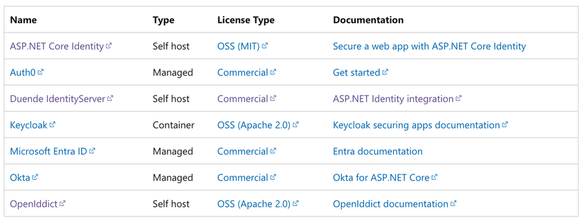

# Background

## IMPLEMENTING AUTH SUCKS

SimpleAuth.NET is a product of frustration with the task of implementing authorization / authentication into my .NET WebApi based applications.

I've been developing apps for nearly 25 years and much of my collective life has been spent tackling auth. It's tedious and temperamental and I could often spend weeks getting auth up and running especially when having to implement a new tech stack or implementing s 3rd party SSO provider. The process goes like this:

1. Pick from the endless list of SSO providers to implement.
2. Search Google for implementation guides given your tech stack.
3. Follow any number of tutorials to the very end to only have them NOT WORK, leaving you to start from the beginning. These SSO providers are so big that anything outside of searches and community support are non existent, so debugging is up to me.
4. Many times I'm doing a simple app where I don't need SSO. In that case, local accounts work just fine.

Not only does auth suck, but it's the first thing that needs to be built into any semi-serious scale of web application. At minimum a user needs to sign in so that the app knows who the user is in order to deliver a personalized experience. This prerequisite of functionality has set the start to my new projects by up to weeks depending on what provider I'm dealing with and how good or bad their documentation is.

## Why SimpleAuth?

Simply put, the number of options for free self-hosted identity options for .NET are limited. Referencing [this article](https://learn.microsoft.com/en-us/aspnet/core/security/identity-management-solutions?view=aspnetcore-8.0), we'll see this list of provider's from Microsoft's documentation:

We'll note that there are 3 self-hosted options, only one of which, [ASP.NET Core Identity](https://dotnet.microsoft.com/apps/aspnet) is a free, open-source product.

## Why not ASP.NET Core Identity?

It's effing complicated! ASP.NET Core Identity is it's own academic unto itself. While it's open source and extendable, it's still pretty complicated and difficult for a beginner to wrap their head around. I also could never seem to find the right tutorial to get it working well with 3rd party SSO providers.

## Why Self Hosted?

For small projects, managing identity shouldn't cost anything. Also, while you can still use cloud authentication, enabling the ability for local accounts removes a dependency from the cloud, which has its benefits.

## Disable Local Accounts for added security

For much of the time, local accounts, even those that use SSO to authenticate, are enough security for 90% of the secured apps out there. Non-mission critical, non-sensitive product or service providers. However, if you're nervous about storing passwords in your database, you can disable local accounts while still storing your user's data. This allows credentials to be managed by SSO providers, but still relate to user records in your database.
