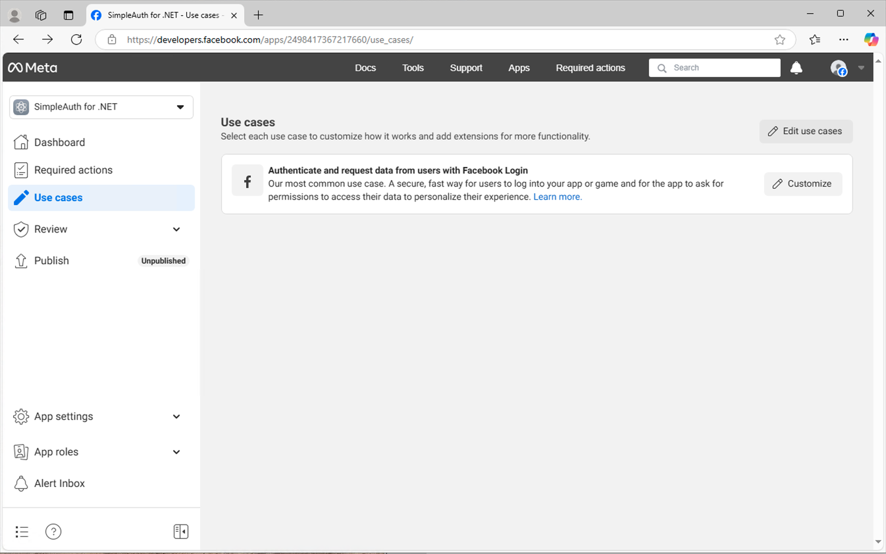

# Facebook SSO Support

You can use Facebook (FB) SSO to authenticate your apps instead of or in addition to built in local accounts. Currently in order for Facebook SSO to work, a local account record needs to be explicitly created for each user. This means that a user must register or be created by an administrator prior to being able to gain access to the app. THIS IS BY DESIGN. In the future, an option will be created to allow for the local account record to be automatically generated at first login.

## Step 1: Register Your App With Facebook

**Prerequisite:** You must already have a Facebook account to do this.

Here's a pretty nice walkthrough on setting up an app using the FB developer console: https://youtu.be/Wp24OmNrr_M?si=hUuZ-dvApWjO0SMn&t=101. However, in the year since this video was created, things have changed (of course), so below is what we see when registering an app in the Facebook Developers area.

1. Log into to https://developers.facebook.com/. Click the "My Apps" link.


1. Click "Create App" button. This will initiate a short guided wizard to help you get started with registering your app with Facebook.


1. Enter the App Name. For this documentation, we will use "SimpleAuth for .NET". Then enter a support email address and press "Next".


1. Next you will be on a "Use Cases" tab, Select "Authenticate and request data from users with Facebook Login" and "Next".


1. In the "Business" step, optionally connect any business entity you might have already set up in Facebook. If not, select "I don't want to connect a business portfolio yet."


1. On the "Finalize" step, you may see some requests for compliance to finalize the set up of your application. Click the "Go to dashboard" button and it will walk you through what you need to become compliant.


1. Click the option to Implement the Facebook login (no screenshot available, sorry.)... Lost track of progress around here... **NOTE:** This documentation below this point is a little spotty.

## Step 2: Customize App Options using the App Dashboard

1. Once you register the app with Facebook, you will be able to access an App Dashboard. You will see this welcome screen. Click the "Go to dashboard" to continue:


1. When you dismiss the welcome modal shown above, you should see something like this. Click the "Use cases" option.


1. On the "Use Cases" screen, you will see the "Authenticate and request data from users with Facebook Login" line item. Click the "Customize" button.


1. **Important:** Make sure to enable the 'email' scope property.


1. Return to the app dashboard and click the "App Settings" and then "Basic" menu options. You will see the page below. Take note of the App ID and the App Secret for later.


## Step 3: Configure Your App to Use Facebook

**NOTE:** The "Login with Facebook" feature is only implemented into the Angular app for now.

### Step 1 - Add the Facebook script to your index.html

1. Go to [Facebook's Login Button documentation page](https://developers.facebook.com/docs/facebook-login/web/login-button/)


1. Click the "Get Code" button. A modal will appear. Copy the `<script>` tag into your application's index.html page.


The script will look something like this:

``` html
<script
    async
    defer
    crossorigin="anonymous"
    src="https://connect.facebook.net/en_US/sdk.js#xfbml=1&version=v21.0&appId=YOUR_FACEBOOK_APP_ID_HERE"
></script>
```

### Step 2 - Configure App Settings

1. Open your API's [App Settings](./app-settings.md) file located in `WebApi\WebApi\appsettings.json`.

1. In the `AppConfig` section, set the `EnableFacebookSso` value to `true`. Also set the value of the `FacebookAppId` setting to the value you took note of in the "App Settings --> Basic" area of the Facebook Dashboard.

1. In the `AuthSettings` section, set the `FacebookAppSecret` to the value you took note of in the "App Settings --> Basic" area of the Facebook Dashboard.

1. When using Facebook authentication, HTTPS is required on the client application. So, instead of running this command to start the Angular app: `npm start`, use this command instead: `ng serve --ssl true`

1. Navigate to https://localhost:4200 to test the new functionality.

**IMPORTANT NOTE:** A user record must already exist in the AppUser table where the username matches the username of the Facebook user that is trying to login using FB SSO.
