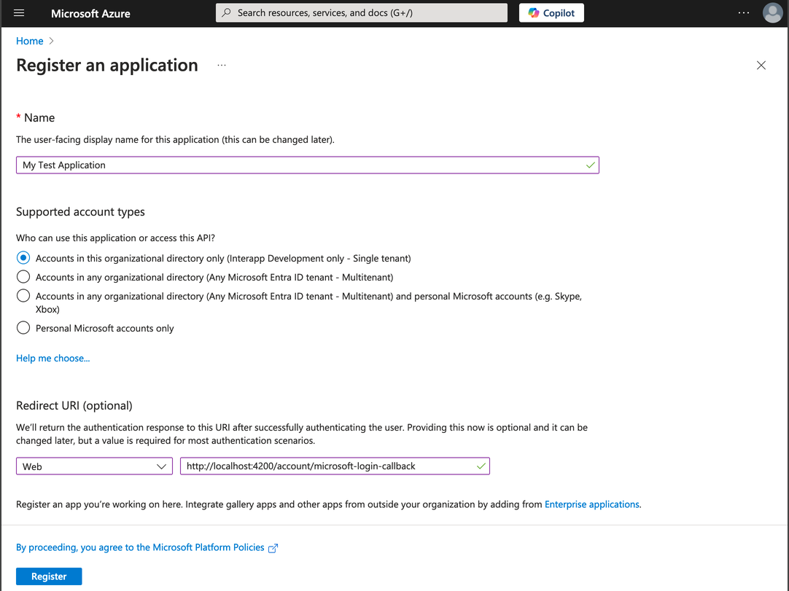
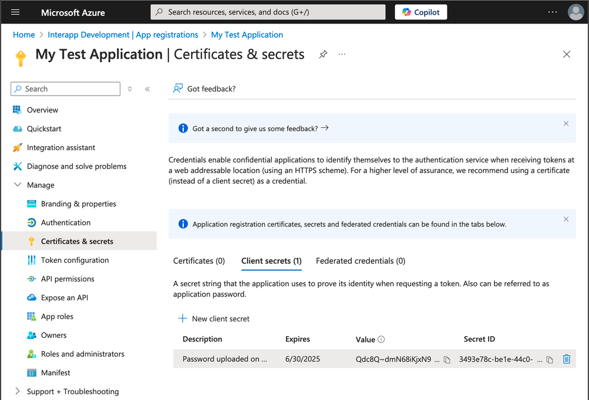

# Microsoft Entra ID SSO Support

You can use Microsoft Entra ID SSO to authenticate your apps instead of or in addition to built in local accounts. Currently in order for Microsoft Entra ID SSO to work, a local account record needs to be explicitly created for each user. This means that a user must register or be created by an administrator prior to being able to gain access to the app. THIS IS BY DESIGN. In the future, an option will be created to allow for the local account record to be automatically generated at first login.

## Step 1: Register your App in the Azure Portal

**Prerequisite:** You will need to [create a new Azure account](https://azure.microsoft.com/en-us/pricing/purchase-options/azure-account) with Microsoft to do this.

1. Log into https://portal.azure.com with your Azure credentials.

1. Navigate to the [Microsoft Entra ID](https://portal.azure.com/#view/Microsoft_AAD_IAM/ActiveDirectoryMenuBlade/~/Overview) area in the Azure portal.

1. On the left navigation menu, expand the "Manage" menu and then select [App Registrations](https://portal.azure.com/#view/Microsoft_AAD_IAM/ActiveDirectoryMenuBlade/~/Overview).

1. Click the [Register an Application](https://portal.azure.com/#view/Microsoft_AAD_RegisteredApps/CreateApplicationBlade/quickStartType~/null/isMSAApp~/false) button.

1. Enter your application information:

    1. Name - The name of your application. For this example, we will use "My Test Application".
    1. Support account types - This documentation only officially supports "Single tenant" applications, but this could change.
    1. Redirect URI - Select `Web` as the platform and enter `http://localhost:4200/account/microsoft-login-callback`.

1. Click the "Register" button to continue.

1. Navigate back to the [App Registrations](https://portal.azure.com/#view/Microsoft_AAD_IAM/ActiveDirectoryMenuBlade/~/RegisteredApps) area. You will see a list of application owned by you. You many have to click the "All Applications" tab to see your newly registered "My Test Application" (or whatever you named it). Click on it for more details and you will see the following overview screen. Take note of the following details: "Application (client) ID" and "Directory (tenant) ID".

1. Under the "Client credentials" section of the overview page, click the "Add a certificate or secret" link.

1. Click the "New client secret" button. Enter info for the following fields:

    1. Description - For this example I'm entering "My Test Application Client Secret".
    1. Expires - Recommended is 180 days. You will need to add to your calendar a reminder to rotate this secret before the selected expiration period expires.

1. Take note of the new value of the client secret in the "Value" column of the table you see on the resulting "Certificates & secrets" page.

At this point, you should have everything set up that you need to authenticate with Azure in your local application.

## Step 2 - Configuration Your Application for Microsoft Entra ID SSO

1. Open your API's [App Settings] file located in `WebApi\WebApi\appsettings.json`

1. In the [`AppConfig`](./app-settings.md#appconfig-section) section of the file make the following changes:

    1. Set the `EnableMicrosoftSso` value to `true`.
    1. Set the `MicrosoftTenantId` value to the "Directory (tenant) ID"  value noted when registering an application.
    1. Set the `MicrosoftClientId` value to the "Application (client) ID" value noted when registering an application.

1. In the [`AuthSettings`](./app-settings.md#authsettings-section) section of the file:

    1. Set the `MicrosoftClientSecret` value to the value noted on the "Certificates & secrets" page in the Azure Portal.

This should be all that is needed to allow for your application to authenticate with Microsoft Entra ID.
