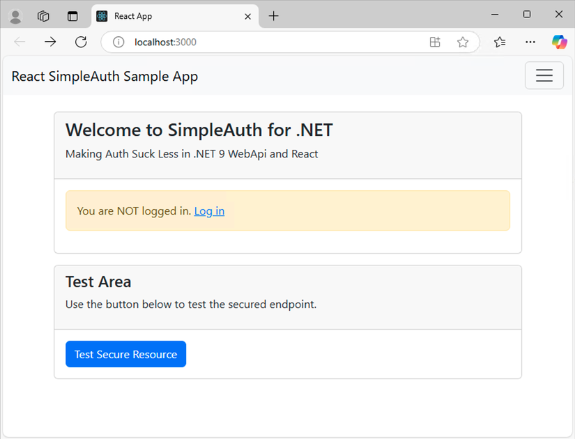
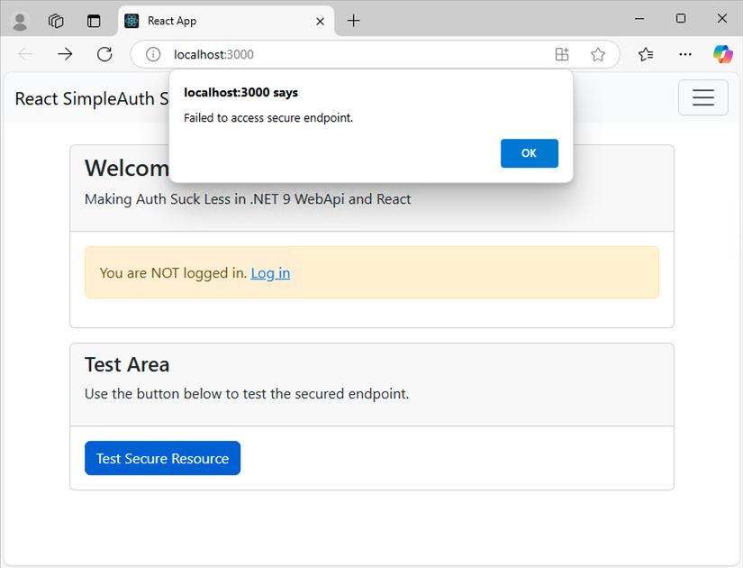
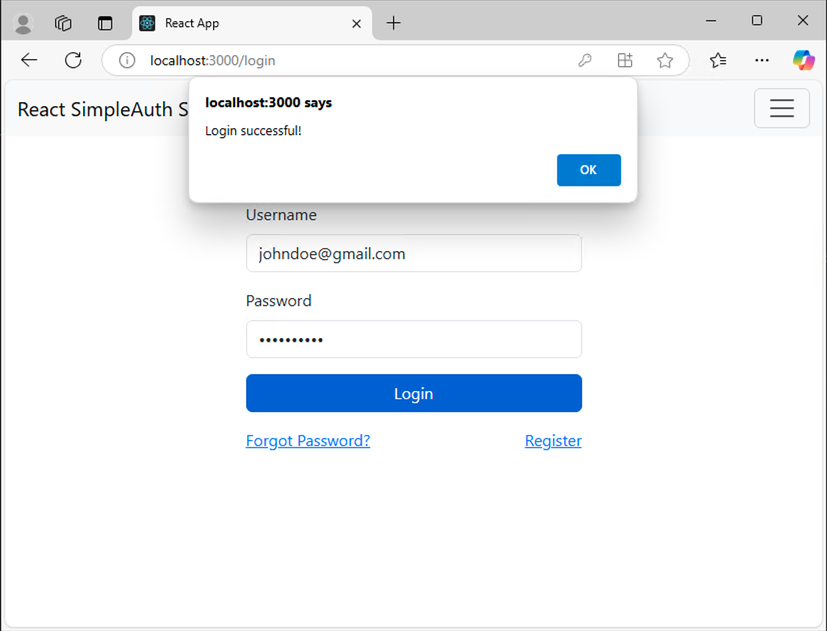
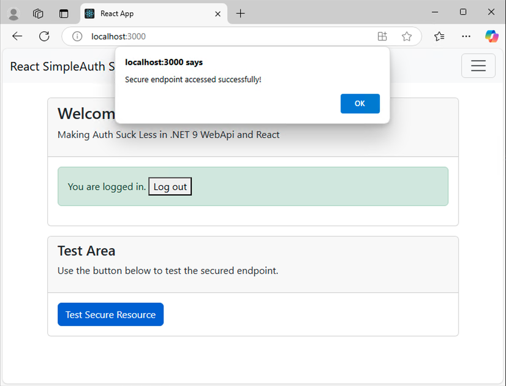

# React App

The current version of the React implementation is a no-frills proof of concept. Improvements may come in the future. Bootstrap 5 in installed to help this look a little nicer.

## Running the Vue App

To run the Vue App from a command prompt, from the root of the repo directory type:

``` command
cd react-app
npm install
npm start
```

## Home Page

Upon first opening the React app, you'll see the home page:



## Test Secure Resource

Pressing the "Test Secure Resource" button prior to logging in should fail:



## Login Success

Entering correct credentials shows a success message:



## Home Page after Logging In

After logging in, you'll see a message confirming that you are logged in and the "Test Secure Resource" button should now work:



## Configuring the App

The app is pre-configured to use the local Kestrel URL of the WebApi:
`http://localhost:5218/`

This value can be changed in the `services/AuthService.tsx` file.
