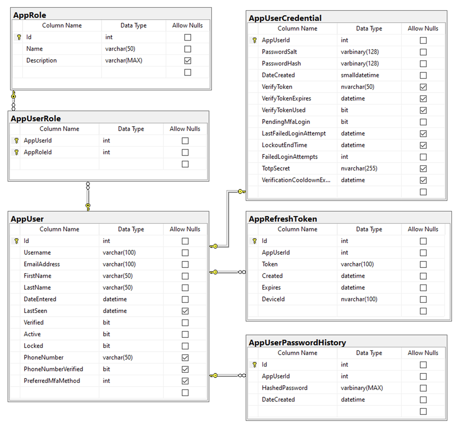

# The Database

Tables are prefixed with `App` to help group entities together in SSMS and Model file names.

**TODO:** Detail each column of each table

## AppUser Table

The AppUser table contains basic, non secret user information. This information should be considered safe to show somewhere on a public profile given user consent, of course.

## AppRole Table

The AppRole table contains the list of Roles to be assigned to users. The name of the role would be used to help identify the access level of a user or lock down an endpoint. For example, to find out if the current user is in the "Admin" role, I could use this:
`var isAdmin = User.Identity.IsInRole("Admin")`

To secure a WebApi controller or endpoint, you can secure it using the following decorator:
`[Authorize(Roles = "Admin")]`

## AppUserRole Table

The AppUserRole table is the many-to-many relationship table joining the AppUser and AppRole tables.

## AppCredential Table

The AppUserCredential table contains salted/hashed passwords for users as well as information to facilitate the password reset process for local accounts and maintains a one-to-one relationship with the AppUser table. The reason for this data being apart from the AppUser table is to keep secrets safe and to prevent developers from having to redact sensitive information from web traffic when displaying information about other users.

## AppRefreshToken

The AppRefreshToken table stores refresh tokens for users sessions. There is a trigger on this table to delete tokens that have expired more than 1 day ago.
