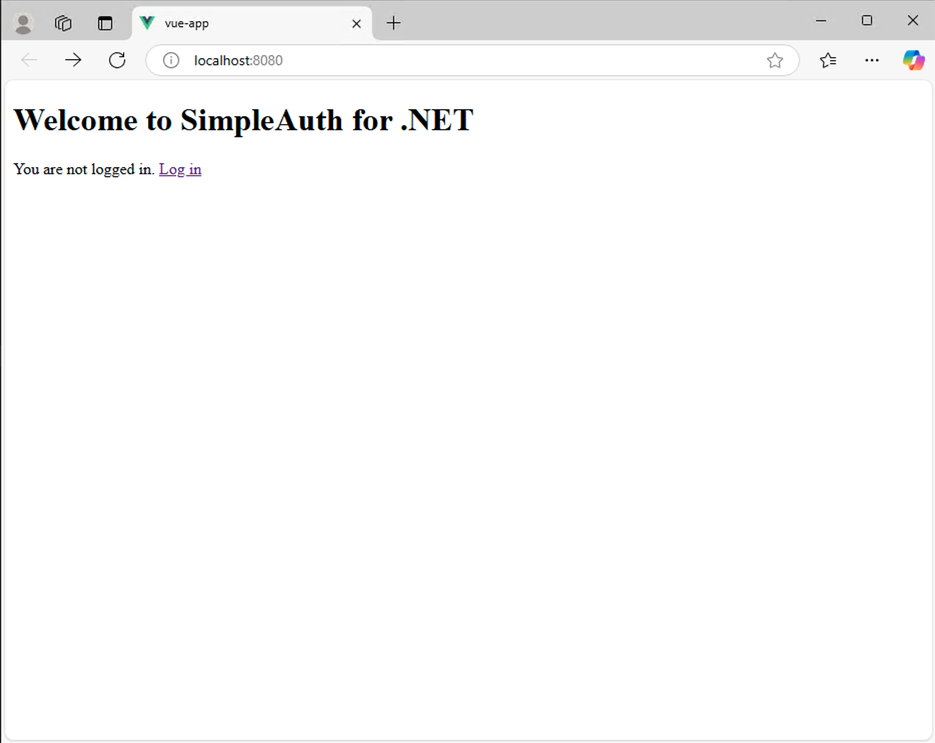
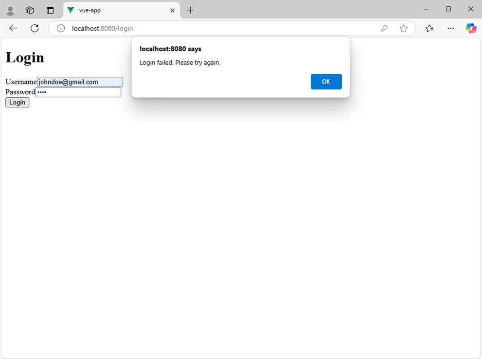
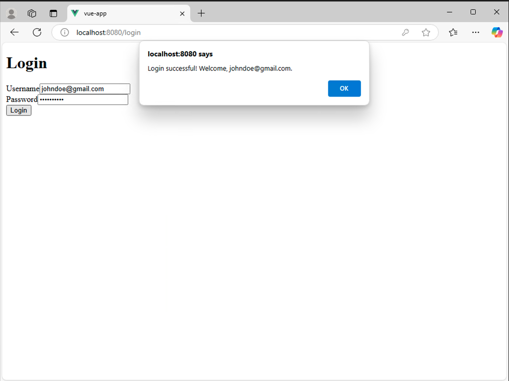
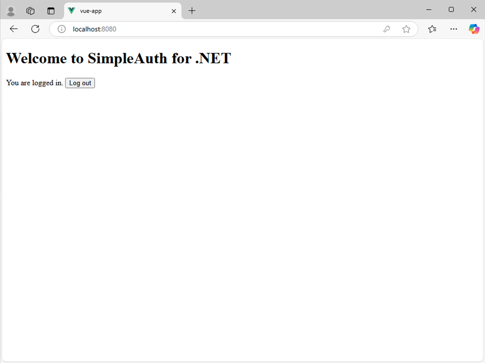

# Vue App

The current version of the Vue implementation is a no-frills proof of concept. Improvements may come in the future.

## Running the Vue App

To run the Vue App from a command prompt, from the root of the repo directory type:

``` command
cd vue-app
npm install
npm run serve
```

## Home Page

Upon first opening the Vue app, you'll see the home page:



## Login Failed

Entering invalid credentials shows an error:



## Login Success

Entering correct credentials shows a success message:



## Home Page after Logging In



## Configuring the App

The app is pre-configured to use the local Kestrel URL of the WebApi:
`http://localhost:5218/`

This value can be changed in the `services/AuthService.ts` file.